# Thin-Objects bCENIC — Experiment Analysis

_Generated by `project_plan/experiments/analyze.py`. Regenerate any time
with `python3 project_plan/experiments/analyze.py`; the underlying data in
`project_plan/data/` is complete and no experiment needs re-running for the
analyses below._

## Instrumentation: what is measured, and why

Every CENIC run records three layers of data:

1. **Per-(sub)step statistics** (`steps.tsv`, from `CenicStepStatistics`):
   step type (full/half/half), time, step size, solver iterations,
   line-search iterations (total/max/mean), Hessian condition numbers
   (max/last), extent-field start values e₀ (max/mean), and active
   constraint-pair count. These drive the dt-vs-time, contacts-vs-time,
   conditioning, and iteration figures.
2. **Run summary** (`PrintSimulatorStatistics` JSON in `stdout.log` +
   `summary_demo.json`): total solver iterations / Hessian factorizations /
   line-search iterations, step counts and sizes, **runtime breakdown**
   (convex solve, model update, CCD feasibility, external-system
   linearization — new timers added for this campaign), and **CCD
   feasibility rejection counters per check site** (full / half-1 / half-2 —
   these disambiguate non-penetration rejections from error-control
   shrinkages, which the step log alone cannot).
3. **Run metadata** (`meta.json`): full argv, parameters, git SHA, wall
   time, exit code — enough to reproduce any run exactly.

Key derived metrics: **RTR** (real-time ratio = simulated / wall seconds),
**accepted-step reconstruction** (a half_step_2 record whose successor
advances time), and **rejection split** (CCD vs error control).

## Master summary table

| experiment | run | wall [s] | RTR | steps | mean dt | min dt | CCD rej | EC rej | mean #c | max #c | mean it | p95 it | max cond |
|---|---|---|---|---|---|---|---|---|---|---|---|---|---|
| E1_ball_beta | beta0.25_acc0.001 | 1.07 | 2.8 | 231 | 0.0148 | 7.10e-04 | 351 | 1 | 96 | 256 | 4.21 | 10 | 2.52e+07 |
| E1_ball_beta | beta0.25_acc0.01 | 1.14 | 2.64 | 209 | 0.0158 | 7.63e-04 | 448 | 0 | 96.2 | 263 | 3.84 | 9 | 2.48e+07 |
| E1_ball_beta | beta0.25_acc0.1 | 1.18 | 2.53 | 216 | 0.015 | 7.63e-04 | 469 | 0 | 95.4 | 261 | 3.54 | 8 | 2.10e+07 |
| E1_ball_beta | beta0.5_acc0.001 | 1.05 | 2.87 | 233 | 0.015 | 9.19e-04 | 362 | 4 | 92.5 | 292 | 3.55 | 8 | 6.78e+06 |
| E1_ball_beta | beta0.5_acc0.01 | 1.06 | 2.82 | 200 | 0.0161 | 1.13e-03 | 425 | 0 | 98.1 | 250 | 3.4 | 8 | 5.58e+06 |
| E1_ball_beta | beta0.5_acc0.1 | 1.1 | 2.72 | 211 | 0.0154 | 9.77e-04 | 457 | 0 | 91.7 | 242 | 3.08 | 7 | 6.46e+06 |
| E1_ball_beta | beta1_acc0.001 | 1.05 | 2.86 | 223 | 0.0152 | 1.33e-03 | 346 | 1 | 104 | 266 | 3.18 | 7 | 2.05e+06 |
| E1_ball_beta | beta1_acc0.01 | 1.12 | 2.69 | 197 | 0.0167 | 1.53e-03 | 418 | 0 | 103 | 251 | 3.11 | 7 | 1.53e+06 |
| E1_ball_beta | beta1_acc0.1 | 0.967 | 3.1 | 203 | 0.0158 | 7.63e-04 | 435 | 0 | 109 | 260 | 2.61 | 6 | 1.57e+06 |
| E1_ball_beta | beta2_acc0.001 | 0.95 | 3.16 | 191 | 0.0173 | 9.77e-04 | 275 | 6 | 109 | 282 | 2.87 | 6 | 3.15e+05 |
| E1_ball_beta | beta2_acc0.01 | 0.842 | 3.56 | 182 | 0.0177 | 1.41e-03 | 378 | 0 | 114 | 263 | 2.57 | 5 | 3.81e+05 |
| E1_ball_beta | beta2_acc0.1 | 0.838 | 3.58 | 183 | 0.0179 | 9.77e-04 | 387 | 0 | 107 | 265 | 2.22 | 4 | 3.65e+05 |
| E1_ball_beta | beta4_acc0.001 | 1.12 | 2.67 | 280 | 0.0114 | 1.16e-03 | 532 | 0 | 141 | 300 | 2.73 | 5 | 1.04e+05 |
| E1_ball_beta | beta4_acc0.01 | 1.19 | 2.53 | 270 | 0.0115 | 1.53e-03 | 608 | 0 | 162 | 295 | 2.5 | 4 | 1.59e+05 |
| E1_ball_beta | beta4_acc0.1 | 1.11 | 2.71 | 262 | 0.0122 | 1.42e-03 | 590 | 0 | 156 | 313 | 2.03 | 3 | 9.80e+04 |
| E2_wild | cones_acc0.01 | 23.8 | 0.126 | 62 | 0.0484 | 2.03e-04 | 66 | 0 | 2.04e+04 | 3.47e+04 | 3.33 | 13 | 3.21e+10 |
| E2_wild | cones_acc0.1 | 22.2 | 0.135 | 58 | 0.0517 | 2.38e-04 | 63 | 0 | 2.06e+04 | 3.21e+04 | 2.46 | 11.2 | 7.16e+10 |
| E2_wild | plate_and_spatula_acc0.01 | 1.82 | 1.1 | 164 | 0.0123 | 2.68e-05 | 308 | 0 | 461 | 820 | 7.82 | 17 | 7.13e+11 |
| E2_wild | plate_and_spatula_acc0.1 | 2.08 | 0.961 | 178 | 0.0113 | 2.12e-05 | 372 | 0 | 535 | 818 | 6.73 | 17 | 6.75e+11 |
| E2_wild | plate_and_spatula_acc1e-3 | 5.38 | 0.372 | 383 | 5.28e-03 | 3.35e-05 | 371 | 37 | 572 | 799 | 7.6 | 17 | 6.54e+11 |
| E2_wild | sphere_and_spiral_acc0.01 | 25.4 | 0.393 | 1.27e+03 | 8.17e-03 | 1.39e-04 | 2440 | 48 | 105 | 918 | 5.9 | 16 | 1.43e+09 |
| E2_wild | sphere_and_spiral_acc0.1 | 24.3 | 0.411 | 918 | 0.011 | 5.96e-05 | 1928 | 0 | 132 | 847 | 5.83 | 16 | 1.61e+09 |
| E2_wild | teddy_and_torus_acc0.01 | 5.51 | 0.544 | 341 | 8.68e-03 | 2.54e-05 | 648 | 7 | 524 | 1.28e+03 | 9.73 | 21 | 5.30e+10 |
| E2_wild | teddy_and_torus_acc0.1 | 7.84 | 0.383 | 390 | 7.73e-03 | 1.96e-05 | 844 | 0 | 689 | 2.03e+03 | 9.06 | 20 | 8.39e+10 |
| E3a_clutter_beta | beta0.1_acc0.001 | 32.5 | 0.0922 | 497 | 6.17e-03 | 9.79e-05 | 230 | 200 | 1.57e+03 | 3.03e+03 | 10.6 | 20 | 7.25e+09 |
| E3a_clutter_beta | beta0.1_acc0.01 | 17.3 | 0.174 | 292 | 0.0103 | 1.54e-04 | 423 | 13 | 1.39e+03 | 3.14e+03 | 11 | 21 | 6.04e+09 |
| E3a_clutter_beta | beta0.1_acc0.1 | 19 | 0.158 | 263 | 0.0118 | 1.36e-04 | 553 | 0 | 1.49e+03 | 3.15e+03 | 11.3 | 21 | 7.14e+09 |
| E3a_clutter_beta | beta0.25_acc0.001 | 35.6 | 0.0844 | 542 | 5.68e-03 | 1.70e-04 | 236 | 253 | 1.66e+03 | 3.18e+03 | 9.73 | 17 | 1.21e+09 |
| E3a_clutter_beta | beta0.25_acc0.01 | 13.9 | 0.216 | 268 | 0.0112 | 1.58e-04 | 380 | 8 | 1.45e+03 | 3.14e+03 | 9.53 | 17 | 1.15e+09 |
| E3a_clutter_beta | beta0.25_acc0.1 | 14.7 | 0.204 | 264 | 0.0116 | 1.33e-04 | 557 | 0 | 1.37e+03 | 3.08e+03 | 8.95 | 17 | 9.71e+08 |
| E3a_clutter_beta | beta0.5_acc0.001 | 42.9 | 0.0699 | 572 | 5.37e-03 | 1.25e-04 | 242 | 227 | 1.81e+03 | 3.26e+03 | 9.95 | 17 | 2.36e+08 |
| E3a_clutter_beta | beta0.5_acc0.01 | 16.5 | 0.182 | 306 | 9.93e-03 | 1.44e-04 | 454 | 8 | 1.40e+03 | 3.09e+03 | 9.52 | 18 | 2.69e+08 |
| E3a_clutter_beta | beta0.5_acc0.1 | 15.3 | 0.196 | 258 | 0.0117 | 1.53e-04 | 540 | 0 | 1.43e+03 | 3.08e+03 | 8.76 | 16 | 3.01e+08 |
| E3a_clutter_beta | beta1_acc0.001 | 39.2 | 0.0765 | 548 | 5.67e-03 | 1.72e-04 | 243 | 243 | 1.67e+03 | 3.07e+03 | 10.2 | 16 | 5.85e+07 |
| E3a_clutter_beta | beta1_acc0.01 | 16.6 | 0.181 | 290 | 0.0103 | 1.13e-04 | 438 | 0 | 1.67e+03 | 3.10e+03 | 9.18 | 16 | 1.13e+08 |
| E3a_clutter_beta | beta1_acc0.1 | 20.3 | 0.148 | 307 | 9.92e-03 | 1.39e-04 | 671 | 0 | 1.62e+03 | 3.33e+03 | 8.48 | 17 | 6.34e+07 |
| E3a_clutter_beta | beta2_acc0.001 | 36.6 | 0.082 | 545 | 5.58e-03 | 1.48e-04 | 316 | 166 | 1.74e+03 | 3.21e+03 | 10.1 | 17 | 1.66e+07 |
| E3a_clutter_beta | beta2_acc0.01 | 27.5 | 0.109 | 425 | 7.06e-03 | 1.53e-04 | 781 | 2 | 1.92e+03 | 3.29e+03 | 8.78 | 15 | 1.59e+07 |
| E3a_clutter_beta | beta2_acc0.1 | 27.1 | 0.111 | 413 | 7.29e-03 | 1.51e-04 | 949 | 0 | 1.82e+03 | 3.21e+03 | 7.72 | 14 | 1.81e+07 |
| E3a_clutter_beta | beta4_acc0.001 | 49.9 | 0.0601 | 764 | 3.95e-03 | 1.46e-04 | 778 | 118 | 1.86e+03 | 3.28e+03 | 9.6 | 15 | 9.01e+06 |
| E3a_clutter_beta | beta4_acc0.01 | 44.1 | 0.068 | 733 | 4.09e-03 | 1.26e-04 | 1580 | 3 | 1.81e+03 | 2.94e+03 | 8.18 | 13 | 1.07e+07 |
| E3a_clutter_beta | beta4_acc0.1 | 45.5 | 0.0659 | 729 | 4.12e-03 | 1.40e-04 | 1682 | 0 | 1.83e+03 | 2.89e+03 | 7.26 | 13 | 1.07e+07 |
| E3b_clutter_barrier | barrier0.0001_acc0.001 | 32.9 | 0.0911 | 497 | 6.17e-03 | 9.79e-05 | 230 | 200 | 1.57e+03 | 3.03e+03 | 10.6 | 20 | 7.25e+09 |
| E3b_clutter_barrier | barrier0.0001_acc0.01 | 17 | 0.176 | 292 | 0.0103 | 1.54e-04 | 423 | 13 | 1.39e+03 | 3.14e+03 | 11 | 21 | 6.04e+09 |
| E3b_clutter_barrier | barrier0.0001_acc0.1 | 19.2 | 0.156 | 263 | 0.0118 | 1.36e-04 | 553 | 0 | 1.49e+03 | 3.15e+03 | 11.3 | 21 | 7.14e+09 |
| E3b_clutter_barrier | barrier0.0005_acc0.001 | 33.4 | 0.0898 | 457 | 6.77e-03 | 3.03e-04 | 105 | 228 | 1.51e+03 | 2.82e+03 | 11.5 | 21 | 6.25e+09 |
| E3b_clutter_barrier | barrier0.0005_acc0.01 | 11.8 | 0.254 | 200 | 0.015 | 5.43e-04 | 231 | 14 | 1.25e+03 | 2.87e+03 | 12.1 | 23.4 | 8.55e+09 |
| E3b_clutter_barrier | barrier0.0005_acc0.1 | 11.4 | 0.262 | 170 | 0.0181 | 4.82e-04 | 323 | 0 | 1.24e+03 | 2.88e+03 | 12.2 | 24 | 7.50e+09 |
| E3b_clutter_barrier | barrier0.001_acc0.001 | 26.3 | 0.114 | 383 | 8.21e-03 | 3.03e-04 | 64 | 237 | 1.41e+03 | 2.71e+03 | 10.8 | 21 | 7.85e+09 |
| E3b_clutter_barrier | barrier0.001_acc0.01 | 9.09 | 0.33 | 161 | 0.0189 | 8.54e-04 | 153 | 20 | 1.21e+03 | 2.77e+03 | 12.3 | 24 | 1.06e+10 |
| E3b_clutter_barrier | barrier0.001_acc0.1 | 8.73 | 0.343 | 125 | 0.0244 | 8.96e-04 | 206 | 0 | 1.28e+03 | 2.74e+03 | 13.5 | 25 | 7.00e+09 |
| E3b_clutter_barrier | barrier0_acc0.001 | 7.93 | 0.378 | 385 | 8.15e-03 | 5.30e-04 | 0 | 204 | 355 | 605 | 9.19 | 17 | 4.29e+08 |
| E3b_clutter_barrier | barrier0_acc0.01 | 3.41 | 0.88 | 89 | 0.0348 | 3.45e-03 | 0 | 54 | 655 | 3.30e+03 | 10.9 | 21 | 3.45e+10 |
| E3b_clutter_barrier | barrier0_acc0.1 | 1.89 | 1.59 | 43 | 0.0717 | 0.01 | 0 | 11 | 1.16e+03 | 5.80e+03 | 11.9 | 27 | 3.89e+10 |
| E3b_clutter_barrier | barrier1e-05_acc0.001 | 40.8 | 0.0736 | 571 | 5.39e-03 | 8.83e-05 | 359 | 207 | 1.82e+03 | 3.40e+03 | 11 | 19 | 7.67e+09 |
| E3b_clutter_barrier | barrier1e-05_acc0.01 | 21.8 | 0.138 | 375 | 8.16e-03 | 6.04e-05 | 640 | 3 | 1.57e+03 | 3.28e+03 | 10.7 | 20 | 8.14e+09 |
| E3b_clutter_barrier | barrier1e-05_acc0.1 | 21.3 | 0.141 | 351 | 8.64e-03 | 6.56e-05 | 756 | 0 | 1.57e+03 | 3.39e+03 | 10 | 18 | 7.35e+09 |
| E3c_clutter_E_margin | E100000_margin0.0001 | 30.3 | 0.0991 | 382 | 7.86e-03 | 1.22e-04 | 718 | 4 | 1.75e+03 | 3.24e+03 | 10.8 | 20 | 5.57e+07 |
| E3c_clutter_E_margin | E100000_margin0.0005 | 23.6 | 0.127 | 280 | 0.0107 | 4.17e-04 | 451 | 6 | 2.51e+03 | 3.46e+03 | 9.54 | 20 | 7.48e+07 |
| E3c_clutter_E_margin | E100000_margin0.001 | 29.1 | 0.103 | 240 | 0.0125 | 1.01e-03 | 330 | 6 | 3.60e+03 | 4.85e+03 | 10.3 | 21 | 9.41e+07 |
| E3c_clutter_E_margin | E1e+07_margin0.0001 | 21.2 | 0.141 | 308 | 9.80e-03 | 1.53e-04 | 480 | 0 | 1.59e+03 | 3.50e+03 | 11 | 21 | 5.81e+07 |
| E3c_clutter_E_margin | E1e+07_margin0.0005 | 21.1 | 0.142 | 263 | 0.0114 | 3.39e-04 | 340 | 10 | 2.35e+03 | 3.35e+03 | 9.9 | 17 | 8.29e+07 |
| E3c_clutter_E_margin | E1e+07_margin0.001 | 27 | 0.111 | 233 | 0.013 | 5.35e-04 | 265 | 18 | 3.40e+03 | 4.74e+03 | 10.4 | 18 | 8.45e+07 |
| E3c_clutter_E_margin | E1e+09_margin0.0001 | 16.3 | 0.185 | 290 | 0.0103 | 1.13e-04 | 438 | 0 | 1.67e+03 | 3.10e+03 | 9.18 | 16 | 1.13e+08 |
| E3c_clutter_E_margin | E1e+09_margin0.0005 | 18.1 | 0.166 | 245 | 0.0122 | 4.08e-04 | 303 | 11 | 2.41e+03 | 3.27e+03 | 9.28 | 16 | 9.58e+07 |
| E3c_clutter_E_margin | E1e+09_margin0.001 | 28.1 | 0.107 | 239 | 0.0126 | 1.09e-03 | 282 | 16 | 3.59e+03 | 5.13e+03 | 10.1 | 17 | 1.26e+08 |
| E3c_clutter_E_margin | E1e+11_margin0.0001 | 20.6 | 0.146 | 340 | 8.86e-03 | 1.17e-04 | 522 | 0 | 1.67e+03 | 3.35e+03 | 9.44 | 17 | 7.79e+07 |
| E3c_clutter_E_margin | E1e+11_margin0.0005 | 27.3 | 0.11 | 294 | 0.0102 | 4.96e-04 | 394 | 18 | 2.63e+03 | 3.73e+03 | 9.97 | 16 | 7.54e+07 |
| E3c_clutter_E_margin | E1e+11_margin0.001 | 26.2 | 0.115 | 246 | 0.0122 | 9.01e-04 | 268 | 14 | 3.43e+03 | 4.72e+03 | 9.81 | 17 | 9.62e+07 |
| E3d_clutter_scaling | boxes_opp10_acc0.01 | 127 | 0.0236 | 655 | 4.69e-03 | 9.59e-05 | 1037 | 15 | 2.35e+03 | 6.25e+03 | 16.1 | 30 | 2.13e+10 |
| E3d_clutter_scaling | boxes_opp10_acc0.1 | 162 | 0.0185 | 690 | 4.37e-03 | 9.55e-05 | 1542 | 0 | 2.33e+03 | 6.05e+03 | 16.5 | 31 | 1.21e+10 |
| E3d_clutter_scaling | opp10_acc0.01 | 111 | 0.0271 | 553 | 5.44e-03 | 1.02e-04 | 874 | 8 | 2.66e+03 | 6.38e+03 | 14.4 | 27 | 1.14e+10 |
| E3d_clutter_scaling | opp10_acc0.1 | 111 | 0.0271 | 539 | 5.66e-03 | 1.03e-04 | 1193 | 0 | 2.27e+03 | 6.48e+03 | 13.7 | 28 | 1.19e+10 |
| E3d_clutter_scaling | opp25_acc0.01 | 1.65e+03 | 1.82e-03 | 1.29e+03 | 2.33e-03 | 4.74e-05 | 2231 | 1 | 4.61e+03 | 1.26e+04 | 19.7 | 41 | 1.83e+10 |
| E3d_clutter_scaling | opp25_acc0.1 | 1.90e+03 | 1.58e-03 | 1.32e+03 | 2.27e-03 | 4.68e-05 | 3016 | 0 | 4.75e+03 | 1.34e+04 | 18.9 | 42 | 3.27e+10 |
| E3e_clutter_wild | beta0.001_acc0.001 | 1.08e+03 | 2.79e-03 | 582 | 5.30e-03 | 2.11e-04 | 14 | 225 | 2.18e+04 | 3.57e+04 | 10.2 | 31 | 5.41e+16 |
| E3e_clutter_wild | beta0.001_acc0.01 | 54.2 | 0.0553 | 126 | 0.0241 | 1.23e-03 | 43 | 35 | 8.14e+03 | 1.78e+04 | 15.6 | 35 | 3.51e+16 |
| E3e_clutter_wild | beta0.001_acc0.1 | 107 | 0.0281 | 105 | 0.0286 | 1.47e-03 | 74 | 0 | 1.32e+04 | 3.35e+04 | 15.9 | 35.3 | 2.14e+16 |
| E3e_clutter_wild | beta0.01_acc0.001 | 618 | 4.85e-03 | 440 | 7.04e-03 | 2.54e-04 | 15 | 186 | 1.74e+04 | 3.66e+04 | 9.02 | 22 | 1.28e+14 |
| E3e_clutter_wild | beta0.01_acc0.01 | 78.9 | 0.038 | 150 | 0.0204 | 9.44e-04 | 42 | 53 | 1.19e+04 | 2.60e+04 | 14.2 | 29 | 4.36e+14 |
| E3e_clutter_wild | beta0.01_acc0.1 | 205 | 0.0147 | 118 | 0.0255 | 9.44e-04 | 108 | 2 | 1.91e+04 | 3.27e+04 | 13.7 | 27 | 7.03e+14 |
| E3e_clutter_wild | beta0.1_acc0.001 | 1.08e+03 | 2.79e-03 | 562 | 5.61e-03 | 1.95e-04 | 17 | 292 | 2.44e+04 | 4.63e+04 | 8.31 | 19 | 4.64e+12 |
| E3e_clutter_wild | beta0.1_acc0.01 | 239 | 0.0126 | 145 | 0.0214 | 7.15e-04 | 48 | 49 | 2.10e+04 | 4.27e+04 | 12.2 | 24 | 7.28e+12 |
| E3e_clutter_wild | beta0.1_acc0.1 | 201 | 0.0149 | 113 | 0.0267 | 1.69e-03 | 80 | 2 | 2.17e+04 | 3.65e+04 | 11.2 | 21 | 6.59e+12 |
| E3e_clutter_wild | beta1_acc0.001 | 1.01e+03 | 2.96e-03 | 550 | 5.65e-03 | 2.20e-04 | 22 | 247 | 2.46e+04 | 4.17e+04 | 8.28 | 16 | 3.64e+10 |
| E3e_clutter_wild | beta1_acc0.01 | 30.5 | 0.0984 | 138 | 0.0219 | 1.06e-03 | 49 | 36 | 6.78e+03 | 1.44e+04 | 11 | 19 | 5.90e+10 |
| E3e_clutter_wild | beta1_acc0.1 | 47.7 | 0.0629 | 105 | 0.0286 | 1.03e-03 | 79 | 0 | 1.22e+04 | 2.51e+04 | 9.22 | 16 | 3.38e+10 |
| E4_nut_and_bolt | acc0.001_beta0.5 | 3.15e+03 | 1.59e-03 | 795 | 5.77e-03 | 2.95e-05 | 331 | 525 | 1.42e+04 | 5.10e+04 | 5.42 | 13 | 2.87e+09 |
| E4_nut_and_bolt | acc0.001_beta1 | 5.67e+03 | 8.81e-04 | 910 | 5.22e-03 | 4.21e-05 | 320 | 680 | 2.30e+04 | 5.52e+04 | 4.83 | 11 | 4.43e+08 |
| E4_nut_and_bolt | acc0.001_beta2 | 6.40e+03 | 7.81e-04 | 1.16e+03 | 4.01e-03 | 4.06e-05 | 593 | 775 | 2.59e+04 | 5.33e+04 | 4.77 | 10 | 2.28e+08 |
| E4_nut_and_bolt | acc0.01_beta0.5 | 567 | 8.82e-03 | 440 | 0.0114 | 7.63e-05 | 747 | 10 | 7.23e+03 | 5.33e+04 | 5.88 | 15 | 1.03e+09 |
| E4_nut_and_bolt | acc0.01_beta1 | 998 | 5.01e-03 | 552 | 9.11e-03 | 4.66e-05 | 825 | 13 | 1.04e+04 | 5.37e+04 | 5.74 | 13 | 4.32e+08 |
| E4_nut_and_bolt | acc0.01_beta2 | 1.90e+03 | 2.63e-03 | 642 | 7.82e-03 | 9.52e-05 | 806 | 16 | 1.70e+04 | 5.31e+04 | 5.1 | 11 | 2.91e+08 |
| E4_nut_and_bolt | acc0.1_beta0.5 | 333 | 0.015 | 494 | 0.0101 | 7.46e-05 | 1034 | 0 | 4.24e+03 | 5.53e+04 | 5.71 | 15 | 9.92e+08 |
| E4_nut_and_bolt | acc0.1_beta1 | 835 | 5.99e-03 | 515 | 9.76e-03 | 9.02e-05 | 1062 | 0 | 9.06e+03 | 5.52e+04 | 4.88 | 13 | 4.03e+08 |
| E4_nut_and_bolt | acc0.1_beta2 | 1.99e+03 | 2.52e-03 | 622 | 8.04e-03 | 3.21e-05 | 1357 | 0 | 1.76e+04 | 5.42e+04 | 4.3 | 11 | 2.56e+08 |
| E5_toi | ball_on_table_toioff_acc0.001 | 1.77 | 5.64 | 367 | 0.0293 | 1.06e-03 | 415 | 30 | 127 | 283 | 4.26 | 10 | 1.47e+08 |
| E5_toi | ball_on_table_toioff_acc0.01 | 1.8 | 5.56 | 337 | 0.032 | 6.10e-04 | 590 | 0 | 119 | 301 | 4.15 | 10 | 1.90e+08 |
| E5_toi | ball_on_table_toioff_acc0.1 | 1.44 | 6.95 | 316 | 0.0332 | 9.77e-04 | 545 | 0 | 126 | 273 | 3.57 | 9 | 1.31e+08 |
| E5_toi | ball_on_table_toion_acc0.001 | 1.82 | 5.5 | 460 | 0.0231 | 8.99e-05 | 348 | 23 | 107 | 295 | 4.38 | 11 | 1.49e+08 |
| E5_toi | ball_on_table_toion_acc0.01 | 2.07 | 4.84 | 398 | 0.0264 | 8.03e-05 | 487 | 0 | 96.7 | 291 | 4.06 | 10 | 1.60e+08 |
| E5_toi | ball_on_table_toion_acc0.1 | 1.48 | 6.74 | 325 | 0.033 | 8.26e-05 | 429 | 0 | 112 | 313 | 3.67 | 9 | 1.20e+08 |
| E5_toi | sphere_and_spiral_toioff_acc0.001 | 32.6 | 0.307 | 1.60e+03 | 6.45e-03 | 1.28e-04 | 1854 | 289 | 121 | 1.09e+03 | 6.31 | 17 | 2.02e+09 |
| E5_toi | sphere_and_spiral_toioff_acc0.01 | 26.7 | 0.375 | 1.27e+03 | 8.17e-03 | 1.39e-04 | 2440 | 48 | 105 | 918 | 5.9 | 16 | 1.43e+09 |
| E5_toi | sphere_and_spiral_toioff_acc0.1 | 24 | 0.416 | 918 | 0.011 | 5.96e-05 | 1928 | 0 | 132 | 847 | 5.83 | 16 | 1.61e+09 |
| E5_toi | sphere_and_spiral_toion_acc0.001 | 44.5 | 0.225 | 1.26e+03 | 8.28e-03 | 2.47e-04 | 1316 | 458 | 162 | 1.19e+03 | 7.57 | 17 | 5.89e+09 |
| E5_toi | sphere_and_spiral_toion_acc0.01 | 47.9 | 0.209 | 1.06e+03 | 9.74e-03 | 9.93e-05 | 1682 | 70 | 137 | 993 | 7.19 | 16 | 1.03e+09 |
| E5_toi | sphere_and_spiral_toion_acc0.1 | 52.2 | 0.191 | 1.13e+03 | 9.08e-03 | 7.15e-05 | 2058 | 0 | 143 | 1.28e+03 | 6.54 | 14 | 2.73e+09 |
| E6a_ccd_kinematic | grid24 | 0.218 | — | — | — | — | 0 | — | — | — | — | — | — |
| E6b_spinning_plate | w128_toioff | 0.0114 | 176 | 106 | 0.0189 | 8.52e-06 | 21 | 1 | 3.77 | 141 | 0.848 | 1 | 1.39e+09 |
| E6b_spinning_plate | w128_toion | 6.62e-03 | 302 | 100 | 0.02 | 5.03e-05 | 4 | 1 | 2.79 | 140 | 0.518 | 1 | 7.98e+08 |
| E6b_spinning_plate | w2_toioff | 0.0318 | 62.9 | 33 | 0.0606 | 6.07e-05 | 47 | 0 | 185 | 269 | 2.22 | 11.7 | 9.26e+07 |
| E6b_spinning_plate | w2_toion | 0.0292 | 68.6 | 32 | 0.0625 | 8.99e-05 | 10 | 0 | 192 | 274 | 1.86 | 9.25 | 9.78e+07 |
| E6b_spinning_plate | w32_toioff | 0.095 | 21 | 56 | 0.0382 | 9.50e-05 | 66 | 0 | 146 | 275 | 3.6 | 10 | 4.73e+08 |
| E6b_spinning_plate | w32_toion | 0.0868 | 23 | 57 | 0.036 | 1.21e-04 | 36 | 0 | 138 | 274 | 3.67 | 11 | 3.36e+08 |
| E6b_spinning_plate | w8_toioff | 0.0508 | 39.4 | 39 | 0.0517 | 5.48e-05 | 33 | 0 | 186 | 272 | 2.51 | 11 | 1.55e+08 |
| E6b_spinning_plate | w8_toion | 0.0347 | 57.7 | 41 | 0.0488 | 2.05e-04 | 14 | 0 | 165 | 271 | 1.94 | 7.6 | 2.93e+08 |
| E7_hero_dishrack | barrier0.0001_margin0.0001_acc0.1 | 112 | 0.892 | 2.75e+03 | 0.0364 | 2.51e-04 | 4435 | 0 | 615 | 929 | 6.31 | 14 | 2.69e+10 |
| E7_hero_dishrack | barrier0.0001_margin0.0002_acc0.001 | 207 | 0.484 | 6.54e+03 | 0.0156 | 3.97e-04 | 594 | 2.80e+03 | 851 | 1.23e+03 | 5.93 | 11 | 1.76e+10 |
| E7_hero_dishrack | barrier0.0001_margin0.0002_acc0.01 | 129 | 0.778 | 3.50e+03 | 0.0287 | 2.72e-04 | 2366 | 533 | 768 | 1.13e+03 | 7.31 | 14 | 5.72e+10 |
| E7_hero_dishrack | barrier0.0001_margin0.0002_acc0.1 | 95.4 | 1.05 | 2.82e+03 | 0.0355 | 3.81e-04 | 4640 | 2 | 784 | 1.09e+03 | 6.46 | 14 | 4.12e+10 |
| E7_hero_dishrack | barrier0.0001_margin0.0005_acc0.1 | 131 | 0.764 | 2.91e+03 | 0.0344 | 5.47e-04 | 4887 | 2 | 1.08e+03 | 1.56e+03 | 6.38 | 14 | 6.84e+10 |
| E7_hero_dishrack | barrier0.001_margin0.0001_acc0.1 | 34.6 | 2.89 | 1.29e+03 | 0.0778 | 1.00e-03 | 621 | 7 | 368 | 632 | 6.55 | 15 | 8.16e+10 |
| E7_hero_dishrack | barrier0.001_margin0.0002_acc0.1 | 36.8 | 2.71 | 1.27e+03 | 0.0789 | 1.22e-03 | 565 | 12 | 428 | 687 | 6.77 | 16 | 2.01e+10 |
| E7_hero_dishrack | barrier0.001_margin0.0005_acc0.1 | 29.6 | 3.37 | 1.13e+03 | 0.0884 | 1.95e-03 | 264 | 1 | 602 | 943 | 6.41 | 14 | 3.33e+10 |
| E7_hero_dishrack | barrier1e-05_margin0.0001_acc0.1 | 322 | 0.311 | 1.06e+04 | 9.44e-03 | 1.16e-04 | 23555 | 0 | 915 | 1.37e+03 | 4.73 | 10 | 2.14e+10 |
| E7_hero_dishrack | volumetric_acc0.001 | 45.8 | 2.18 | 2.72e+03 | 0.0376 | 7.58e-04 | 0 | 967 | 407 | 1.01e+03 | 4.49 | 8 | 2.28e+10 |
| E7_hero_dishrack | volumetric_acc0.01 | 27.3 | 3.67 | 1.47e+03 | 0.0687 | 4.66e-03 | 0 | 461 | 419 | 1.33e+03 | 5.39 | 11 | 1.09e+11 |
| E7_hero_dishrack | volumetric_acc0.1 | 27.7 | 3.61 | 1.01e+03 | 0.099 | 0.01 | 0 | 17 | 1.61e+03 | 2.76e+03 | 4.4 | 8 | 2.27e+10 |

## Campaign health

The following runs failed or timed out (partial data may still exist):

```
2026-07-24T12:15:25.655669 E3e_clutter_wild/beta1_acc0.1 exit=-6 timed_out=False
2026-07-24T12:20:26.922751 E3e_clutter_wild/beta0.1_acc0.0001 exit=1 timed_out=False
2026-07-24T12:20:27.470772 E3e_clutter_wild/beta0.1_acc0.01 exit=1 timed_out=False
2026-07-24T12:20:27.513598 E3e_clutter_wild/beta0.01_acc0.01 exit=1 timed_out=False
2026-07-24T12:20:32.712285 E3e_clutter_wild/beta0.01_acc0.1 exit=1 timed_out=False
2026-07-24T12:20:37.033560 E3e_clutter_wild/beta0.001_acc0.01 exit=1 timed_out=False
2026-07-24T12:20:41.445568 E3e_clutter_wild/beta0.1_acc0.001 exit=1 timed_out=False
2026-07-24T12:20:42.950700 E3e_clutter_wild/beta0.001_acc0.001 exit=1 timed_out=False
2026-07-24T12:20:45.204339 E3e_clutter_wild/beta1_acc0.001 exit=1 timed_out=False
2026-07-24T12:20:55.781997 E3e_clutter_wild/beta0.01_acc0.001 exit=1 timed_out=False
2026-07-24T12:28:19.633750 E3e_clutter_wild/beta0.001_acc0.01 exit=1 timed_out=False
2026-07-24T12:28:22.371820 E3e_clutter_wild/beta0.1_acc0.1 exit=1 timed_out=False
2026-07-24T14:17:17.490082 E7_hero_dishrack/barrier1e-05_margin0.0005_acc0.1 exit=1 timed_out=False
2026-07-24T14:17:17.492055 E7_hero_dishrack/barrier1e-05_margin0.0002_acc0.1 exit=1 timed_out=False
```

---
## E1 — Barrier & conditioning benchmark (ball on table)

**What is measured.** A single sphere dropped on a table (3 s), sweeping the near-rigid regularization β ∈ {0.25…4} and the target accuracy. Metrics: Hessian condition number (max over solves), solver iterations, integrator step counts.

**Why it is interesting.** β caps the barrier stiffness at m·4π²/(w·β²·dt²); it is *the* knob trading conditioning against contact stiffness fidelity. This is the controlled setting where its effect is cleanly visible (planning-doc Demo 1).

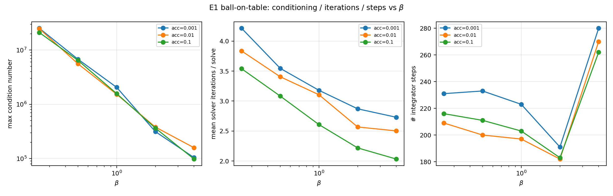

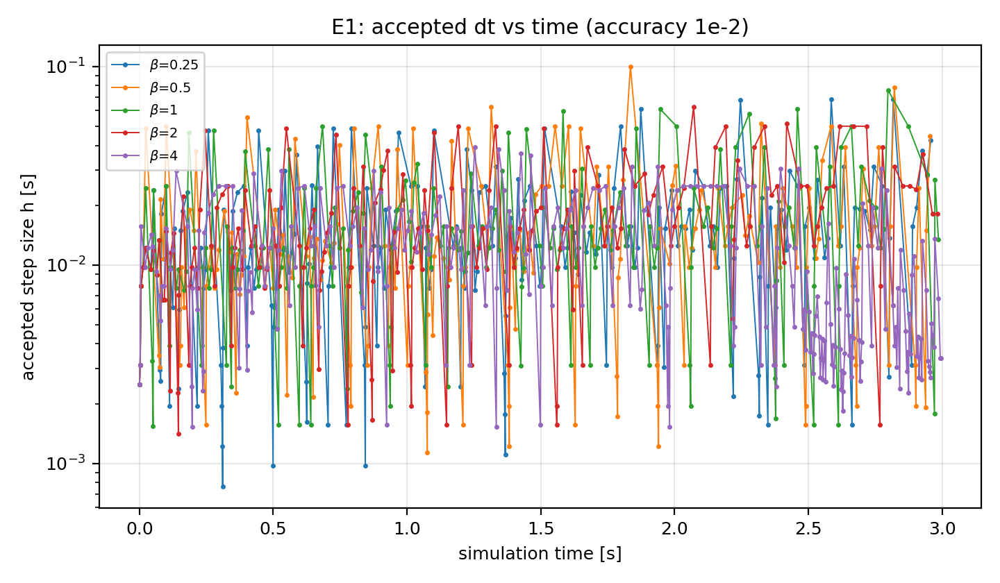


---

## E2 — Thin objects in the wild (capability scenes)

**What is measured.** Four thin/codimensional scenes (plate+spatula, 10 stacked codim cups, teddy+torus, sphere in a spiral tube) at accuracies 1e-1…1e-3. Metrics: accepted dt, contacts, runtime breakdown, RTR.

**Why it is interesting.** These are the qualitative capability results: scenes that volumetric hydroelastic cannot express (open surfaces, codim meshes) running under error control with non-penetration guaranteed by CCD.

| run | wall [s] | RTR | steps | mean dt | min dt | CCD rej | mean #contacts | mean iters |
|---|---|---|---|---|---|---|---|---|
| cones_acc0.01 | 23.8 | 0.126 | 62 | 0.0484 | 2.03e-04 | 66 | 2.04e+04 | 3.33 |
| cones_acc0.1 | 22.2 | 0.135 | 58 | 0.0517 | 2.38e-04 | 63 | 2.06e+04 | 2.46 |
| plate_and_spatula_acc1e-3 | 5.38 | 0.372 | 383 | 5.28e-03 | 3.35e-05 | 371 | 572 | 7.6 |
| plate_and_spatula_acc0.01 | 1.82 | 1.1 | 164 | 0.0123 | 2.68e-05 | 308 | 461 | 7.82 |
| plate_and_spatula_acc0.1 | 2.08 | 0.961 | 178 | 0.0113 | 2.12e-05 | 372 | 535 | 6.73 |
| sphere_and_spiral_acc0.01 | 25.4 | 0.393 | 1266 | 8.17e-03 | 1.39e-04 | 2440 | 105 | 5.9 |
| sphere_and_spiral_acc0.1 | 24.3 | 0.411 | 918 | 0.011 | 5.96e-05 | 1928 | 132 | 5.83 |
| teddy_and_torus_acc0.01 | 5.51 | 0.544 | 341 | 8.68e-03 | 2.54e-05 | 648 | 524 | 9.73 |
| teddy_and_torus_acc0.1 | 7.84 | 0.383 | 390 | 7.73e-03 | 1.96e-05 | 844 | 689 | 9.06 |

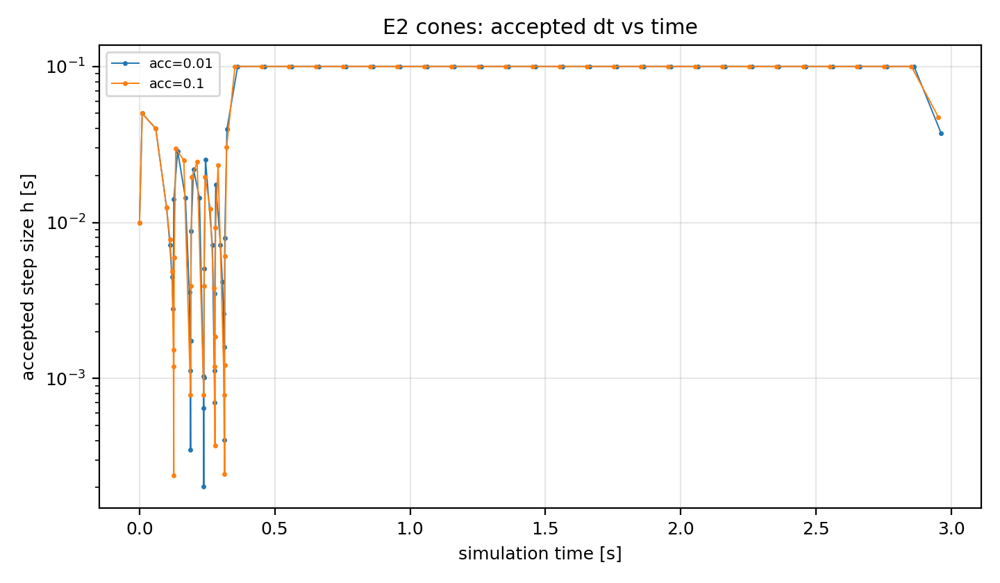

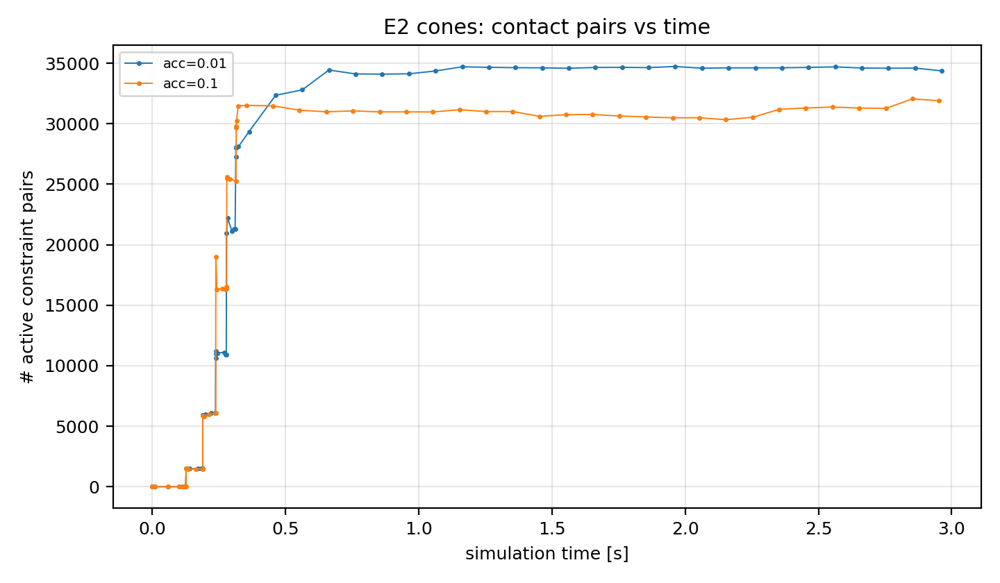

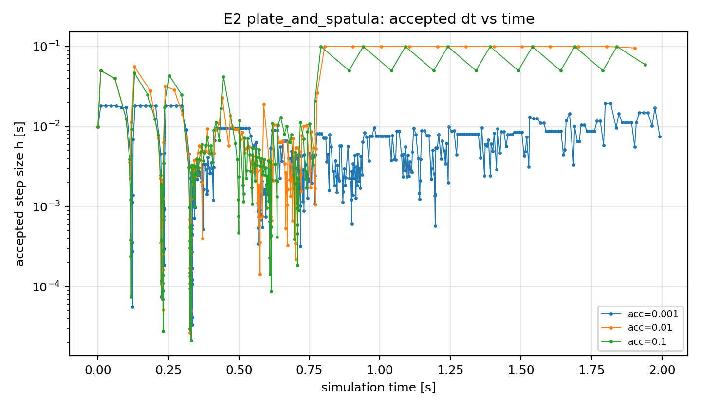

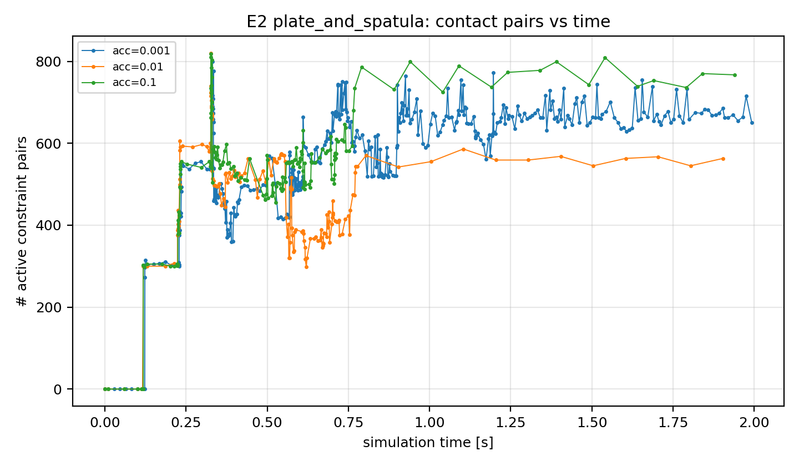

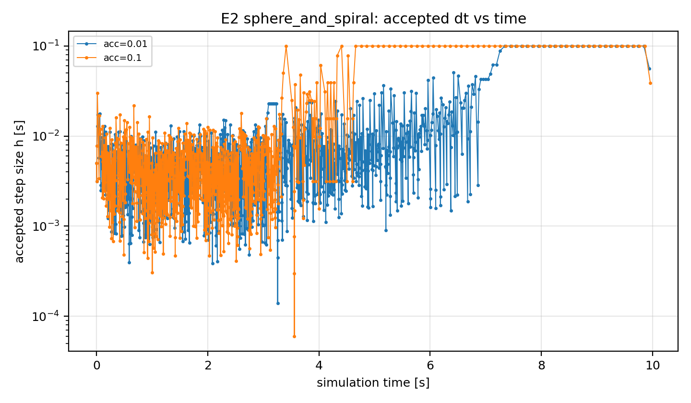

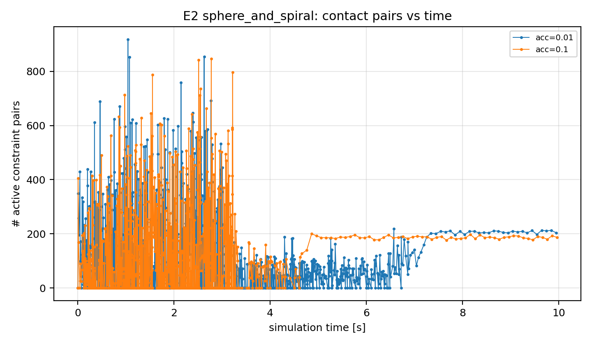

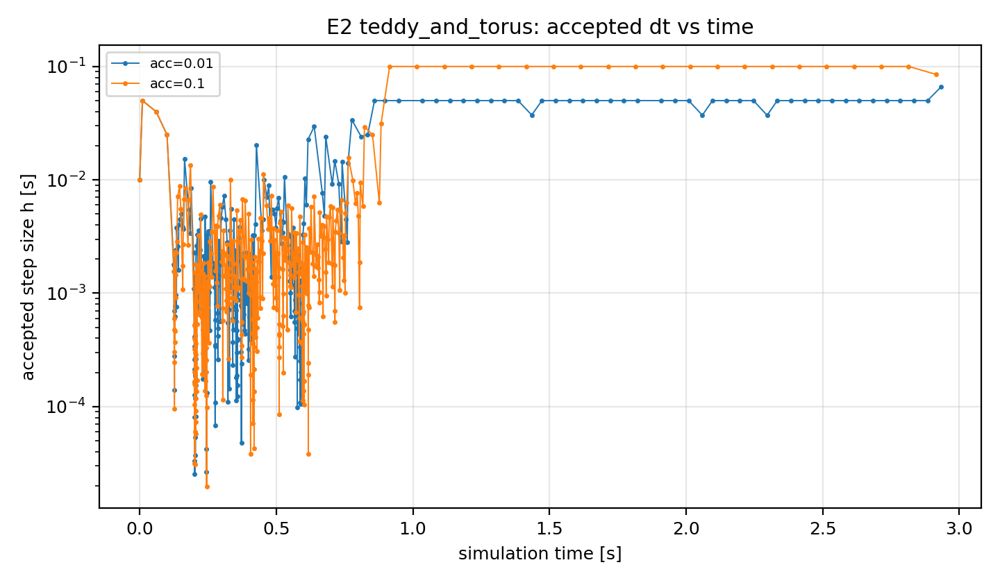

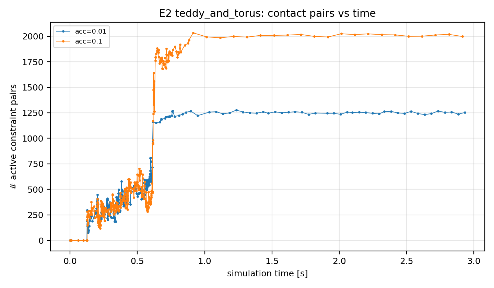

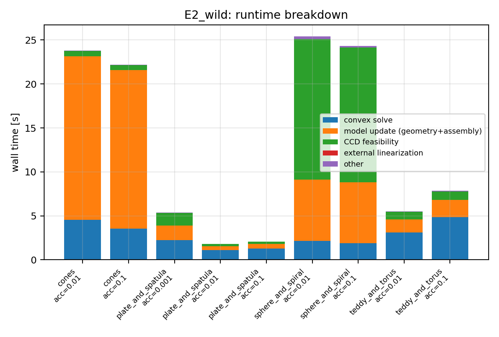


---

## E3a — Clutter: β characterization (Demo 3)

**What is measured.** 20-object sphere clutter in a sink, β ∈ {0.1…4} × accuracy {1e-1,1e-2,1e-3}: conditioning, total solver iterations, wall time, runtime breakdown.

**Why it is interesting.** Confirms in a contact-rich scene what E1 shows in isolation: conditioning scales as ~1/β² while the cost of looser β is longer settling / more iterations. Picks the paper's recommended β.

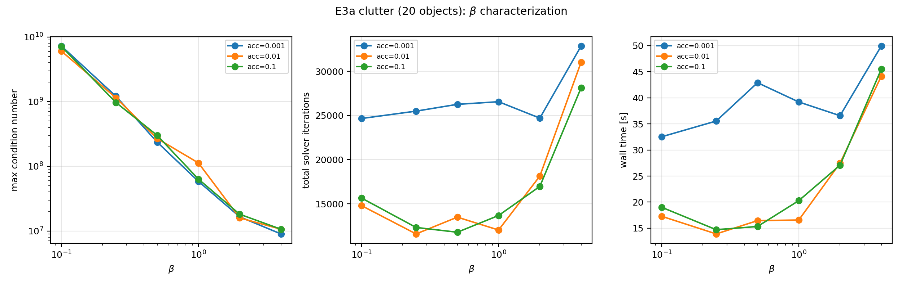

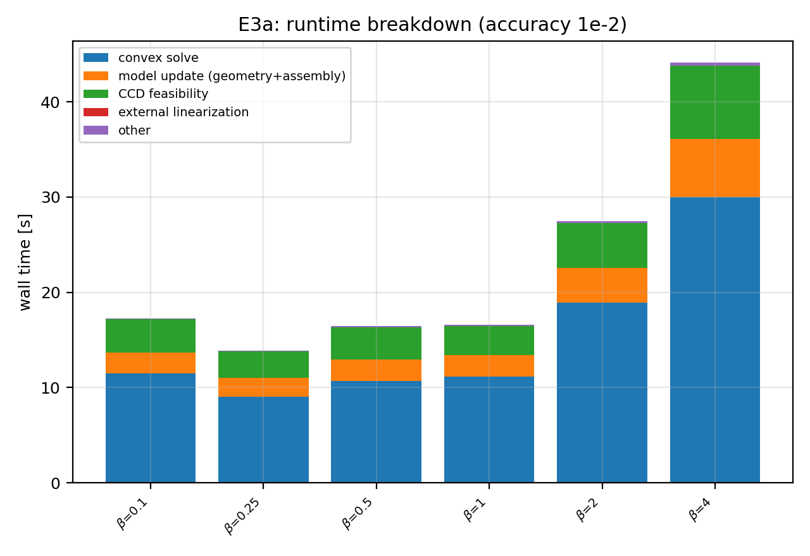


## E3b — Clutter: barrier thickness vs volumetric hydro

**What is measured.** Barrier layer δ ∈ {0, 1e-5…1e-3} m; δ=0 falls back to volumetric hydroelastic for the primitive geometries — the closest thing to an apples-to-apples volumetric baseline without third-party software.

**Why it is interesting.** Cost and robustness of the thin barrier layer vs the classic volumetric model; also shows how CCD activity (rejections) grows as the layer thins.

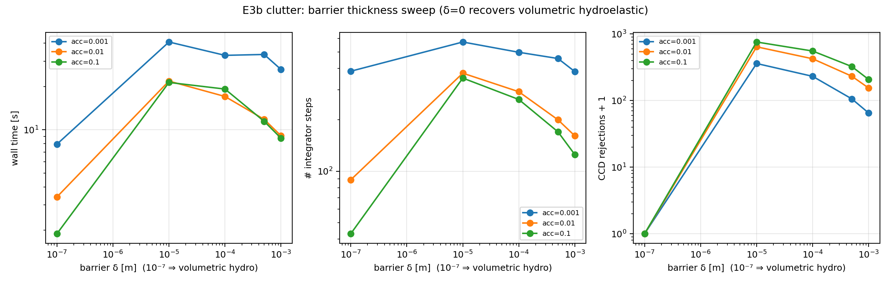


## E3c — Clutter: stiffness × margin

**What is measured.** Material stiffness E ∈ {1e5…1e11} Pa × margin {1e-4…1e-3} m at fixed accuracy/β.

**Why it is interesting.** Demonstrates the β-capped model is insensitive to extreme physical stiffness (the near-rigid continuation absorbs it) — a core robustness claim.

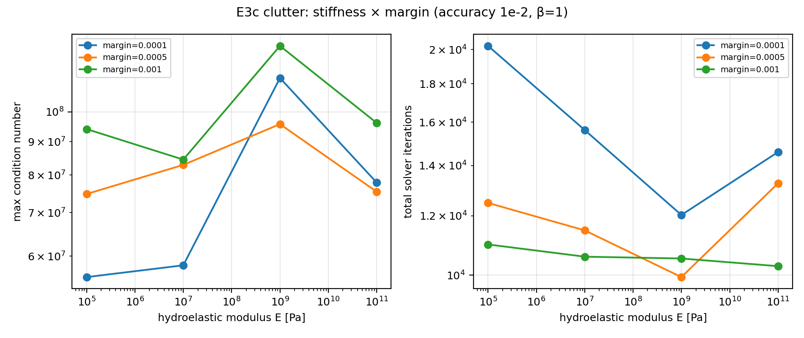


## E3d — Clutter scaling (40–100 objects, boxes)

**What is measured.** Object count scaling (40 and 100 objects; box variants) and — pooled over every clutter run — cost per step vs contact count.

| run | wall [s] | RTR | steps | mean dt | mean #contacts | max #contacts | mean iters |
|---|---|---|---|---|---|---|---|
| boxes_opp10_acc0.01 | 127 | 0.0236 | 655 | 4.69e-03 | 2.35e+03 | 6248 | 16.1 |
| boxes_opp10_acc0.1 | 162 | 0.0185 | 690 | 4.37e-03 | 2.33e+03 | 6048 | 16.5 |
| opp10_acc0.01 | 111 | 0.0271 | 553 | 5.44e-03 | 2.66e+03 | 6385 | 14.4 |
| opp10_acc0.1 | 111 | 0.0271 | 539 | 5.66e-03 | 2.27e+03 | 6475 | 13.7 |
| opp25_acc0.01 | 1.65e+03 | 1.82e-03 | 1287 | 2.33e-03 | 4.61e+03 | 12586 | 19.7 |
| opp25_acc0.1 | 1.90e+03 | 1.58e-03 | 1322 | 2.27e-03 | 4.75e+03 | 13377 | 18.9 |

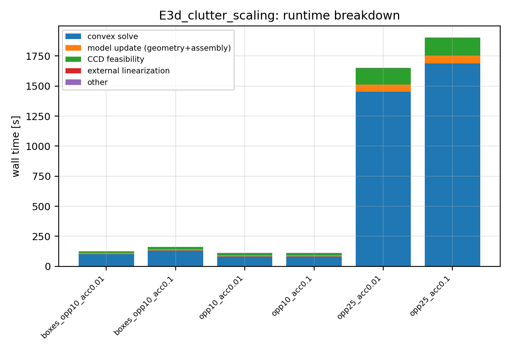

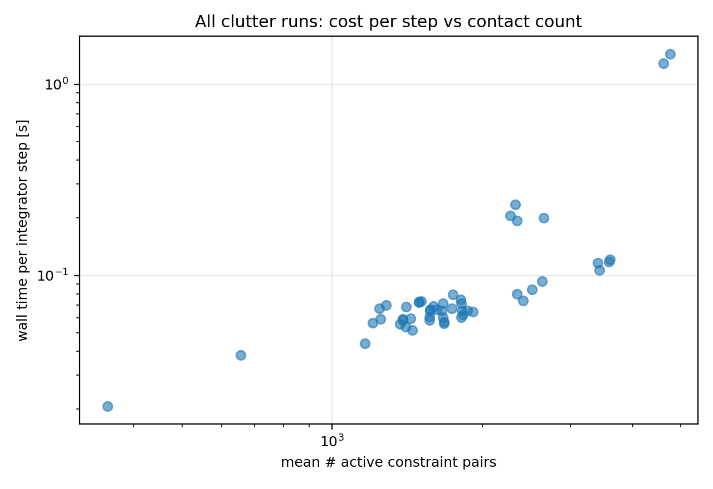


---

## E3e — Clutter of "objects in the wild" (Thingi10K meshes)

**What is measured.** The E3a clutter characterization repeated with 10 real scanned/designed meshes from Thingi10K (2 piles × 5 objects, each mesh once) instead of primitives: β ∈ {0.001, 0.01, 0.1, 1} × accuracy {1e-1 … 1e-4}. Unlike E3a these runs use `use_toi=true` (see THINGI10K_CLUTTER.md).

**Why it is interesting.** Shows the barrier formulation and its β-conditioning trade-off survive contact between arbitrary non-convex meshes, the regime the paper targets.

Full standalone report: [THINGI10K_CLUTTER.md](THINGI10K_CLUTTER.md).


---

## E4 — Nut & bolt (threaded engagement, Demo 4)

**What is measured.** The nut driven down a bolt thread by an external torque (τ=-0.005 N·m), with tight thin-object clearances (margin 1e-5, barrier 2e-5), sweeping accuracy × β. Success = the nut advances without penetration or solver failure.

**Why it is interesting.** The flagship contact-rich assembly task used to argue robustness vs ABD-class methods; threads are the canonical thin-feature failure case for penalty and volumetric models.

| run | wall [s] | RTR | steps | mean dt | min dt | CCD rej | mean #contacts | mean iters | p95 iters |
|---|---|---|---|---|---|---|---|---|---|
| acc0.001_beta0.5 | 3.15e+03 | 1.59e-03 | 795 | 5.77e-03 | 2.95e-05 | 331 | 1.42e+04 | 5.42 | 13 |
| acc0.001_beta1 | 5.67e+03 | 8.81e-04 | 910 | 5.22e-03 | 4.21e-05 | 320 | 2.30e+04 | 4.83 | 11 |
| acc0.001_beta2 | 6.40e+03 | 7.81e-04 | 1160 | 4.01e-03 | 4.06e-05 | 593 | 2.59e+04 | 4.77 | 10 |
| acc0.01_beta0.5 | 567 | 8.82e-03 | 440 | 0.0114 | 7.63e-05 | 747 | 7.23e+03 | 5.88 | 15 |
| acc0.01_beta1 | 998 | 5.01e-03 | 552 | 9.11e-03 | 4.66e-05 | 825 | 1.04e+04 | 5.74 | 13 |
| acc0.01_beta2 | 1.90e+03 | 2.63e-03 | 642 | 7.82e-03 | 9.52e-05 | 806 | 1.70e+04 | 5.1 | 11 |
| acc0.1_beta0.5 | 333 | 0.015 | 494 | 0.0101 | 7.46e-05 | 1034 | 4.24e+03 | 5.71 | 15 |
| acc0.1_beta1 | 835 | 5.99e-03 | 515 | 9.76e-03 | 9.02e-05 | 1062 | 9.06e+03 | 4.88 | 13 |
| acc0.1_beta2 | 1.99e+03 | 2.52e-03 | 622 | 8.04e-03 | 3.21e-05 | 1357 | 1.76e+04 | 4.3 | 11 |

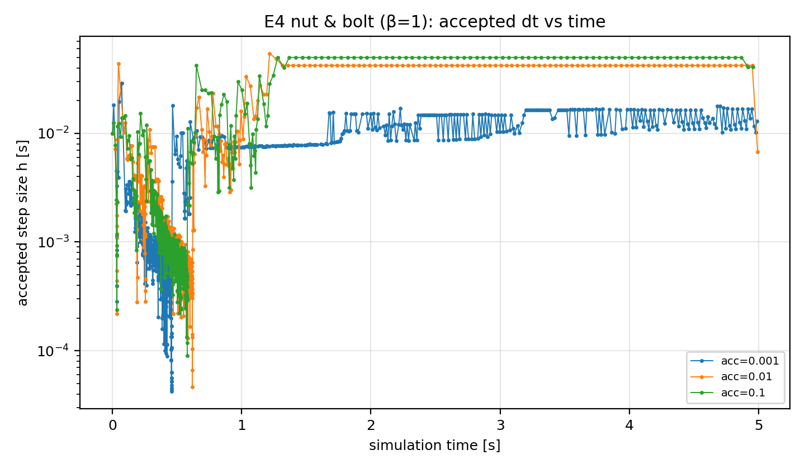

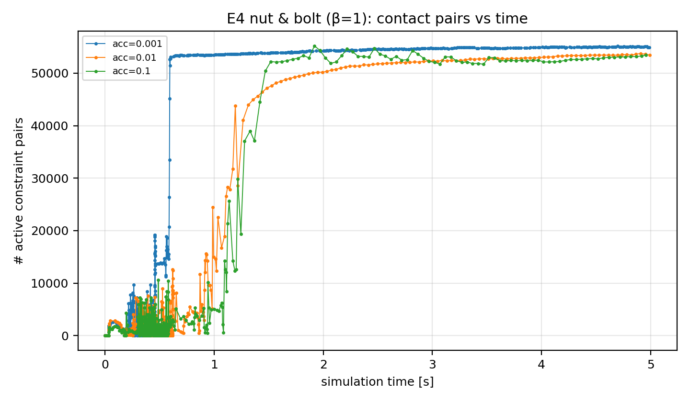

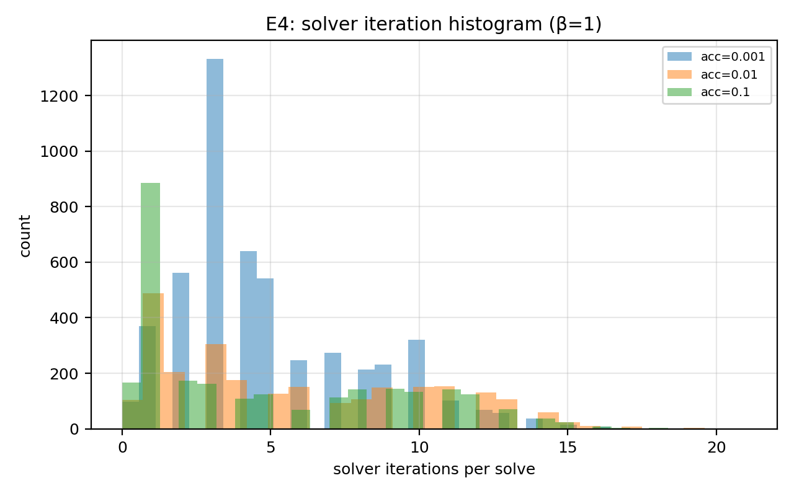

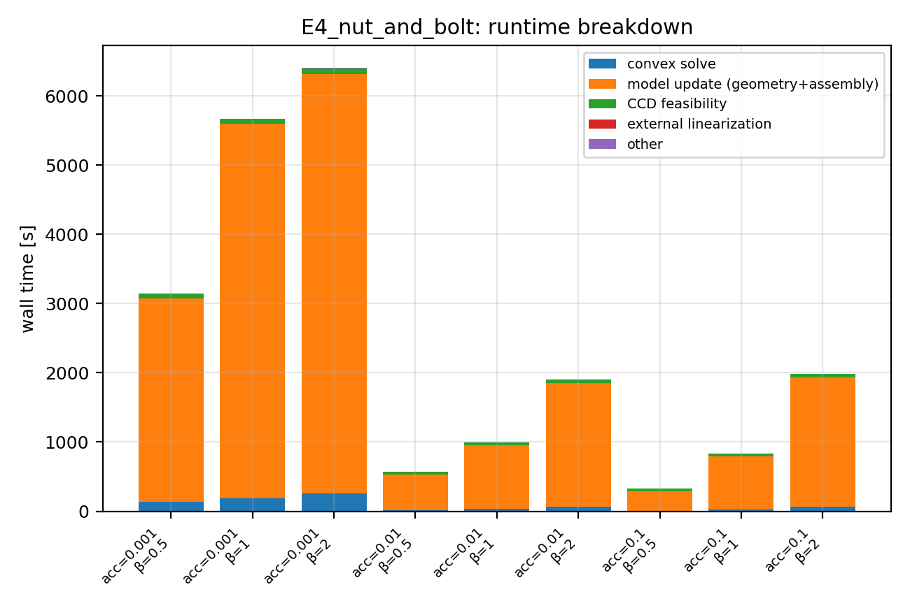


---

## E5 — Time-of-impact vs parallel motion (rolling sphere / spiral)

**What is measured.** Rolling/sliding scenes (sphere on table, sphere descending a spiral tube) with use_toi on/off across accuracies: wall time, min dt, CCD rejections.

**Why it is interesting.** A naive TOI rule collapses dt when motion is *parallel* to the contact (rolling), since the time to impact is always ~0. The claim is that the barrier layer + feasibility formulation avoids this pathology.

| run | wall [s] | steps | mean dt | min dt | CCD rej |
|---|---|---|---|---|---|
| ball_on_table_toioff_acc0.001 | 1.77 | 367 | 0.0293 | 1.06e-03 | 415 |
| ball_on_table_toion_acc0.001 | 1.82 | 460 | 0.0231 | 8.99e-05 | 348 |
| ball_on_table_toioff_acc0.01 | 1.8 | 337 | 0.032 | 6.10e-04 | 590 |
| ball_on_table_toion_acc0.01 | 2.07 | 398 | 0.0264 | 8.03e-05 | 487 |
| ball_on_table_toioff_acc0.1 | 1.44 | 316 | 0.0332 | 9.77e-04 | 545 |
| ball_on_table_toion_acc0.1 | 1.48 | 325 | 0.033 | 8.26e-05 | 429 |
| sphere_and_spiral_toioff_acc0.001 | 32.6 | 1596 | 6.45e-03 | 1.28e-04 | 1854 |
| sphere_and_spiral_toion_acc0.001 | 44.5 | 1259 | 8.28e-03 | 2.47e-04 | 1316 |
| sphere_and_spiral_toioff_acc0.01 | 26.7 | 1266 | 8.17e-03 | 1.39e-04 | 2440 |
| sphere_and_spiral_toion_acc0.01 | 47.9 | 1060 | 9.74e-03 | 9.93e-05 | 1682 |
| sphere_and_spiral_toioff_acc0.1 | 24 | 918 | 0.011 | 5.96e-05 | 1928 |
| sphere_and_spiral_toion_acc0.1 | 52.2 | 1130 | 9.08e-03 | 7.15e-05 | 2058 |

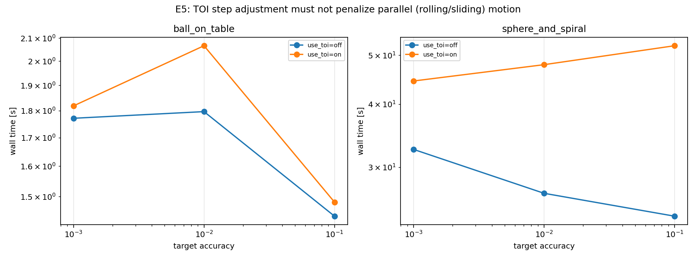

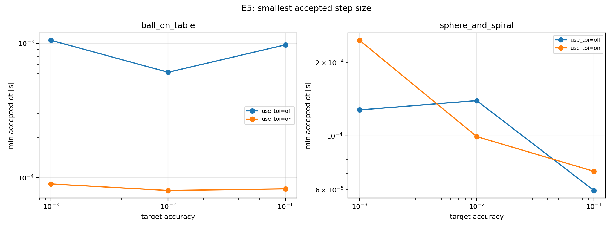


---

## E6a — Rotational CCD error study (kinematic, Demo 5)

**What is measured.** A thin square plate rotates by θ=ω·dt about the world z-axis past a thin obstacle inside its swept annulus. For each (ω, dt): the production linear CCD verdict vs a 64-substep subdivided ground truth, plus query cost vs substep count N.

**Result summary.** 17 false negatives out of 576 grid cells (175 cells have a true collision). The false-negative region concentrates at large θ = ω·dt, quantifying exactly when the linear-trajectory assumption (design-doc issue S1) is unsafe, and the cost ladder gives the measured price of closing it by subdivision (cost is linear in N; see PAPER_NOTES.md for the curved-CCD discussion).

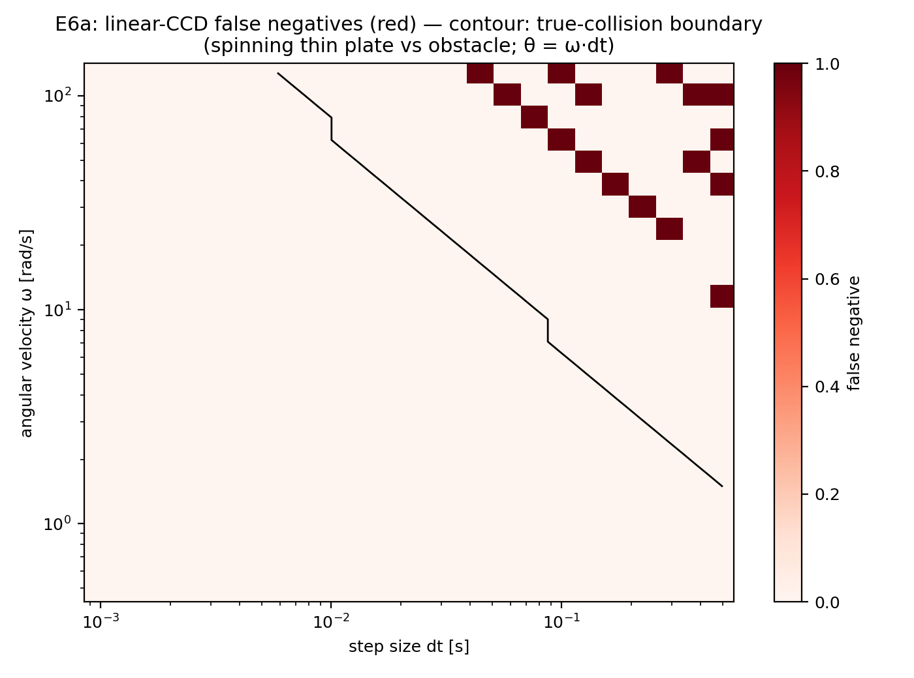

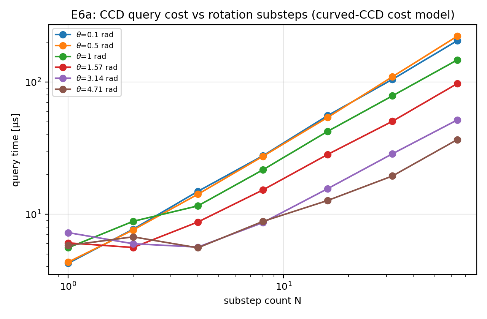


## E6b — Spinning plate (dynamic companion to E6a)

**What is measured.** The spinning_plate example (thin codim plate falling on a table while spinning at ω ∈ {2…128} rad/s, accuracy 1e-2): min dt, CCD rejections, wall time, TOI on/off.

**Why it is interesting.** Shows how the integrator *behaves* in the regime E6a shows is risky: CCD rejections force small steps at high spin — the safe-but-costly response — and TOI-based adjustment changes the cost.

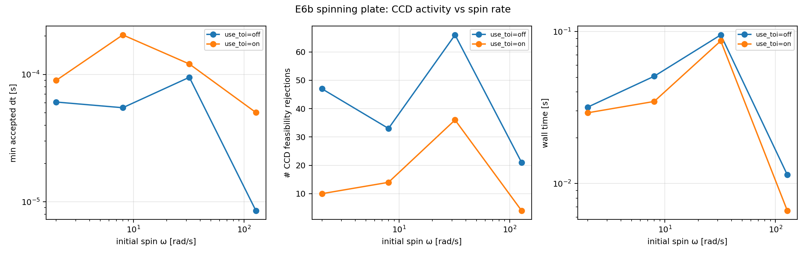


---

## E7 — Hero demo (dishrack playback, real robotics application)

**What is measured.** The 100 s dual-Panda dishrack-loading playback (lbm_eval riverway station; rack, spatula, spoon, mug, crock manipulands with .vtk volumetric collision meshes), driven by recorded joint-space keyframes through stiff PD controllers. Real-time rate vs simulation time (2 s trailing window from the per-step (sim, wall) monitor), contact pairs, accepted dt, and the summary metrics below, comparing thin-layer barrier hydro (margin/barrier swept, accuracy swept) against Drake's default volumetric hydroelastic (barrier=0, margin=0; the .vtk tet meshes with extent fields).

**Why it is interesting.** The paper's hero application: how does bCENIC compare against ICF with volumetric hydro on a long-horizon real manipulation task with thin geometry (rack wireframe, utensils)? Volumetric hydro needs accuracy ≈1e-3 to avoid thin-object artifacts, while barrier hydro aims to run artifact-free at loose accuracy — the RTR-vs-time comparison quantifies the payoff.

**Feasibility boundary.** The barrier=1e-5 grid cells with margin ≥ 2e-4 abort at startup (`calc_N_x` consistency guard): surface ε = −2·margin/barrier ≤ −40 and the scene's initial resting contacts pierce the 10 µm layer. Only margin=1e-4 survives at barrier=1e-5 — the barrier thickness must not be small relative to the initial contact penetration. Failed runs are absent from the table (see the failure report section).

| run | wall [s] | RTR | steps | mean dt | min dt | CCD rej | EC rej | mean #contacts | max #contacts |
|---|---|---|---|---|---|---|---|---|---|
| barrier1e-05_margin0.0001_acc0.1 | 322 | 0.311 | 10608 | 9.44e-03 | 1.16e-04 | 23555 | 0 | 915 | 1373 |
| barrier0.0001_margin0.0001_acc0.1 | 112 | 0.892 | 2754 | 0.0364 | 2.51e-04 | 4435 | 0 | 615 | 929 |
| barrier0.001_margin0.0001_acc0.1 | 34.6 | 2.89 | 1289 | 0.0778 | 1.00e-03 | 621 | 7 | 368 | 632 |
| barrier0.0001_margin0.0002_acc0.001 | 207 | 0.484 | 6541 | 0.0156 | 3.97e-04 | 594 | 2798 | 851 | 1229 |
| barrier0.0001_margin0.0002_acc0.01 | 129 | 0.778 | 3498 | 0.0287 | 2.72e-04 | 2366 | 533 | 768 | 1133 |
| barrier0.0001_margin0.0002_acc0.1 | 95.4 | 1.05 | 2822 | 0.0355 | 3.81e-04 | 4640 | 2 | 784 | 1089 |
| barrier0.001_margin0.0002_acc0.1 | 36.8 | 2.71 | 1269 | 0.0789 | 1.22e-03 | 565 | 12 | 428 | 687 |
| barrier0.0001_margin0.0005_acc0.1 | 131 | 0.764 | 2909 | 0.0344 | 5.47e-04 | 4887 | 2 | 1.08e+03 | 1558 |
| barrier0.001_margin0.0005_acc0.1 | 29.6 | 3.37 | 1132 | 0.0884 | 1.95e-03 | 264 | 1 | 602 | 943 |
| volumetric_acc0.001 | 45.8 | 2.18 | 2716 | 0.0376 | 7.58e-04 | 0 | 967 | 407 | 1009 |
| volumetric_acc0.01 | 27.3 | 3.67 | 1467 | 0.0687 | 4.66e-03 | 0 | 461 | 419 | 1332 |
| volumetric_acc0.1 | 27.7 | 3.61 | 1010 | 0.099 | 0.01 | 0 | 17 | 1.61e+03 | 2759 |

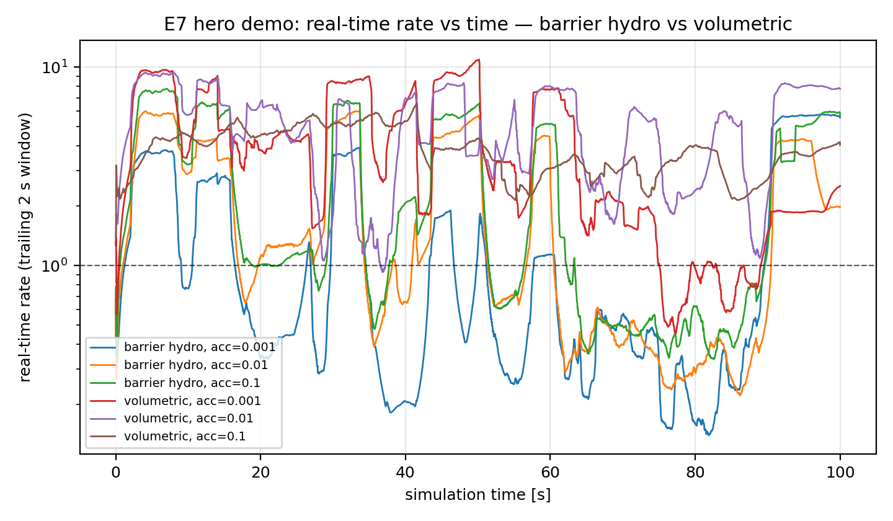

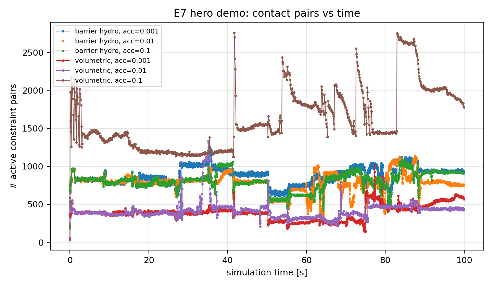

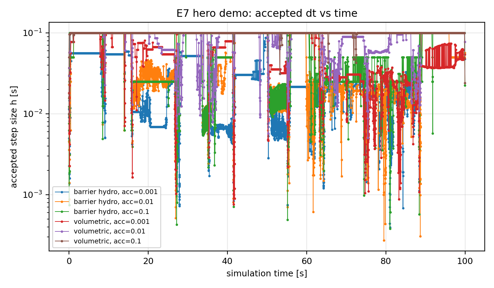

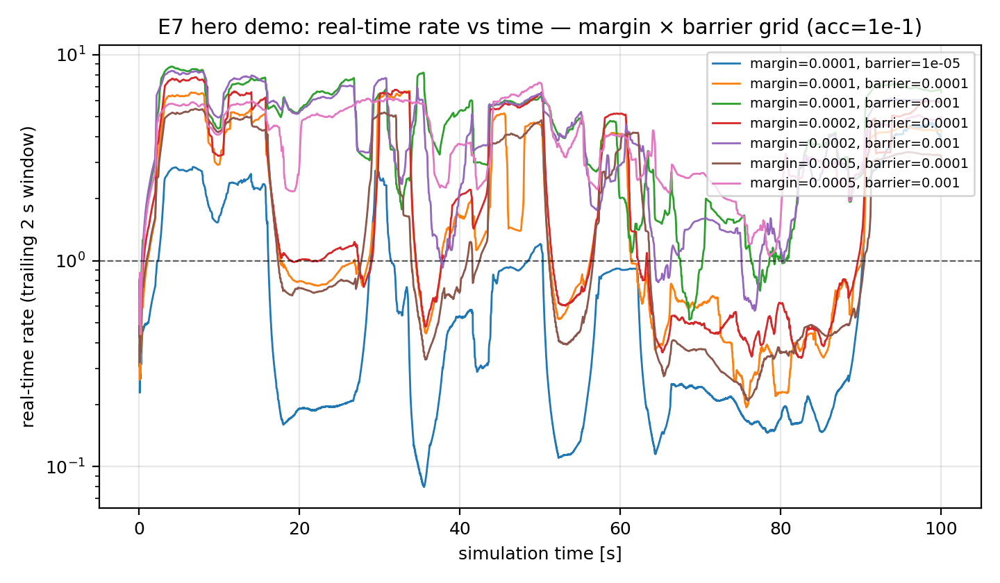

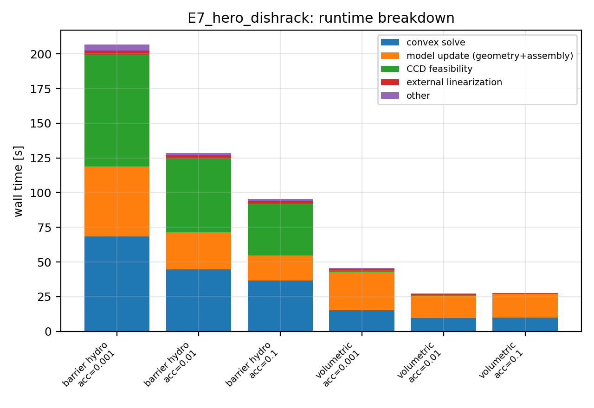


---

## Method figures (analytic, no simulation)

**What is shown.** Direct plots of the RegularizedBarrierModel math (patch_constraints_pool.cc): the barrier impulse n(e) = dt·A₀E*·e/(1−e) with its near-rigid analytic continuation for several β (C¹ splice at x_nr = min(1, √(k_lin/k_nr))), the stiffness cap k_nr ∝ 1/(β·dt)², and the solver-facing N/n/dn(v) functions.

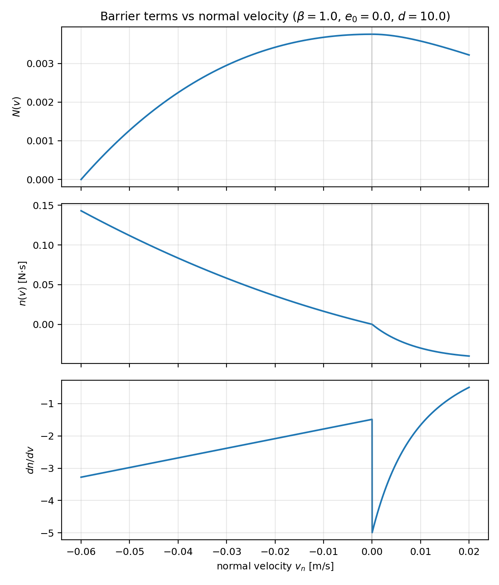

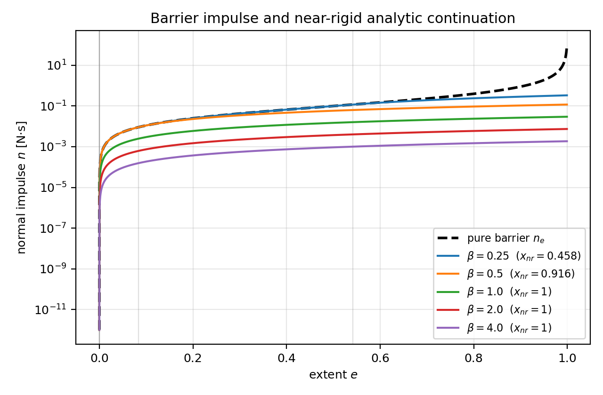

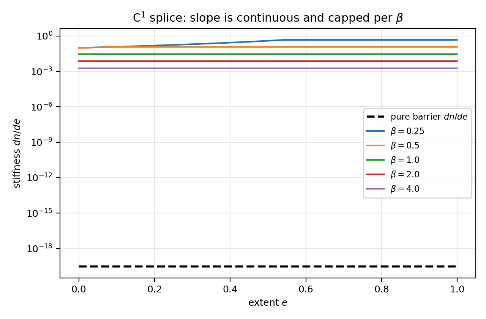

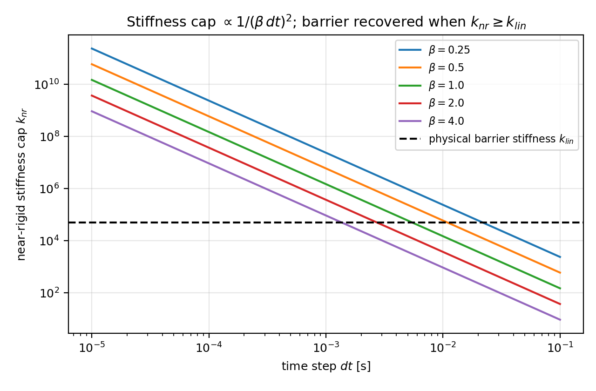


---

## Code-change suggestions (data-driven)

- Measured runtime shares (mean over 69 runs): convex solve 57%, model update (geometry + constraint assembly) 27%, CCD feasibility 15%. Optimization effort should follow these shares; see the runtime-breakdown figures per experiment.
- `icf_builder.cc` hot path still contains a debug `fmt::print`+`throw` block for zero-area dual cells and commented-out variant code; none of the campaign runs tripped it, so it can be reduced to a `DRAKE_THROW_UNLESS` with a proper message (design-doc X1/X4).
- `patch_constraints_pool.cc` `UpdateTimeStep` runs an `isnan` sweep with 15 `fmt::print`s per failure and a hot-path `DRAKE_DEMAND` in `calc_N_x`; move both behind `DRAKE_ASSERT`-level checks now that the campaign exercised the model across 10+ decades of parameters without firing them.
- `cenic_integrator.cc` recomputes `GetAllGeometryPosesInWorld()` (a full map copy) up to 4× per step; the E6b/E4 runs show CCD time is dominated by these harvests at small contact counts. Cache the map per evaluation or return a const reference (design-doc X6).
- The rejection counters show CCD rejections are overwhelmingly `full_step` rejections; the two half-step checks rarely fire (see master table `rej_ccd` vs experiment figures). If profiling confirms, the half1 check (same start poses as the full step) could reuse the full-step BVH moving frames instead of recomputing.
