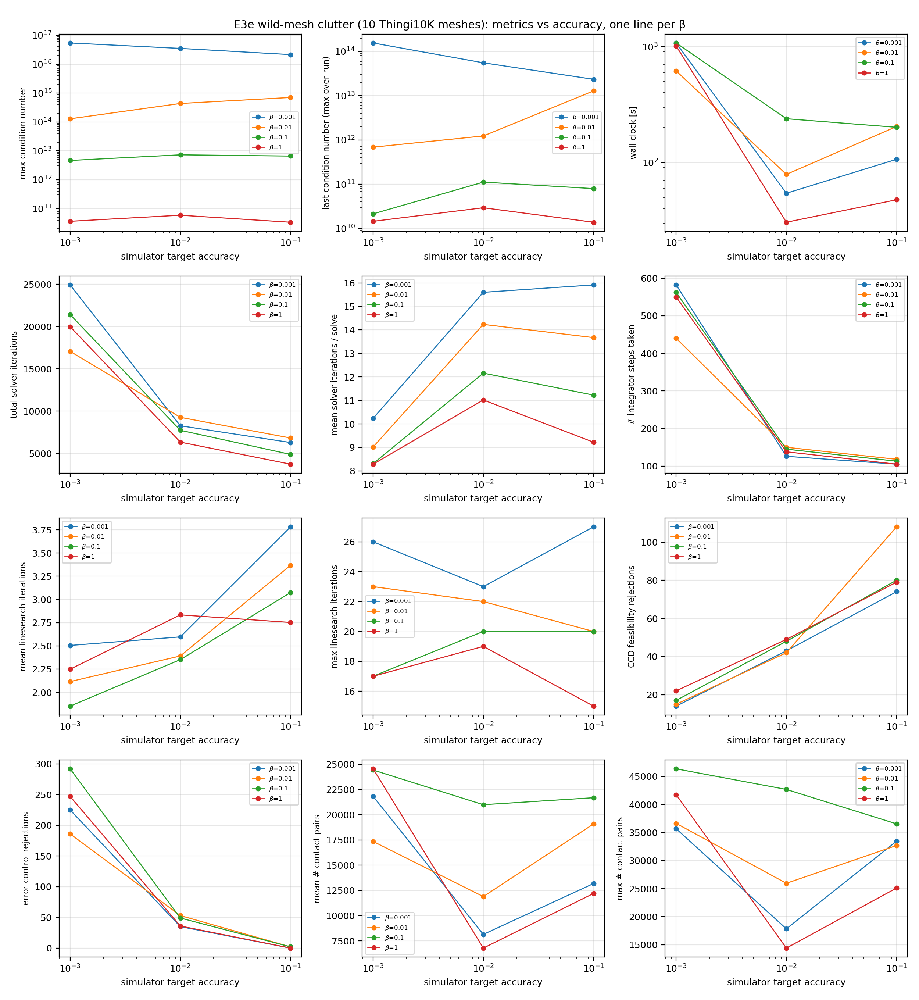
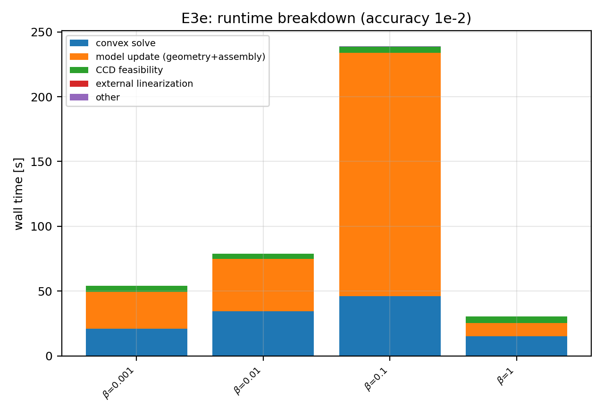
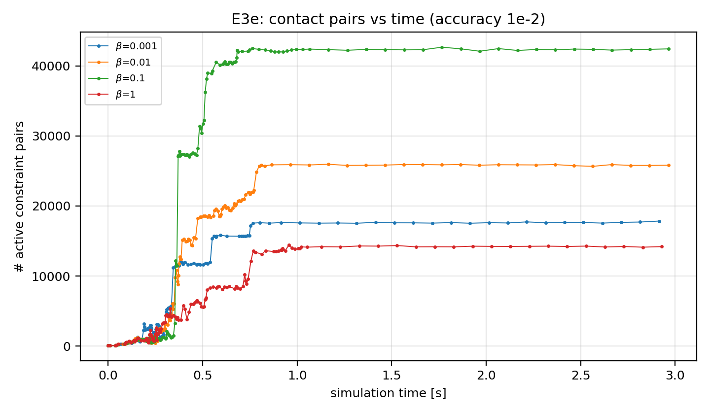
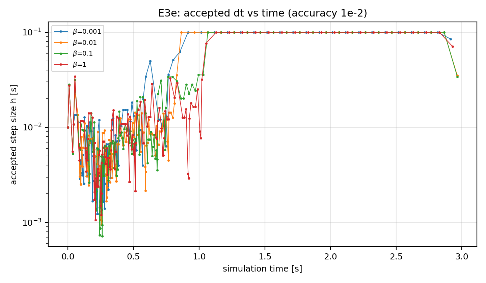

# Clutter of "objects in the wild" — Thingi10K meshes (E3e)

_Generated by `project_plan/experiments/analyze.py`. This is the first
experiment of `project_plan/docs/Thin Objects.txt`: the numerical
characterization of the clutter scene, but with real meshes instead of
primitives._

## Setup

Ten meshes from the [Thingi10K](https://ten-thousand-models.appspot.com/)
dataset are dropped into the sink scene of
`examples/multibody/clutter` (4 piles × 3 objects = 12 bodies; the 10
meshes cycle, so two appear twice), sweeping β ∈ {0.001, 0.01, 0.1, 1.0}
× simulator target accuracy ∈ {1e-1, 1e-2, 1e-3, 1e-4}. All other
parameters match the E3a primitive-clutter runs (3 s simulation,
hydroelastic, margin=1e-4, E=1e9, density 1000 kg/m³) with three
deviations, all forced by the mesh scene:

> **`use_toi = true`, `barrier = 1e-3`, and 3-object stacks (E3a used no
> TOI, barrier=1e-4, and 5-object stacks).** With the E3a defaults, the
> pile impact at t≈0.21–0.34 s drives contact points fully through the
> thin extruded barrier layer (margin+barrier = 2e-4 m): the per-step
> extent-field maximum e₀ reaches 2.0 — the rigid-core value, i.e. the
> log-barrier singularity — and the runs abort with dt collapsed below the
> 1e-14 minimum. 12 of 16 grid cells failed that way (survivors peaked at
> e₀ ≈ 1.95–1.98). A 1e-3 barrier layer (within the project plan's design
> range δ ≈ 0.1–1 mm) plus TOI fixed most cells, but 5-object stacks drop
> the top mesh from ~0.6 m and individual cells still pierced chaotically
> (e.g. β=0.1/acc=1e-1 hit e₀=2 with cond 4.7e20 at barrier 1e-3 while
> passing at 1e-4). With ~0.38 m maximum falls (3-object stacks) every
> screened cell carries the impact with e₀ ≤ ~1.97. This is itself a
> finding: several of these meshes are thin plates (3–7 mm), and clutter
> impact onto them sits right at the barrier-pierce threshold that
> primitive clutter never approaches.

The mesh set is curated deterministically by
`project_plan/experiments/thingi10k_meshes.py` (seed 0, 200–5000
faces, well-behaved filter: manifold, oriented, PWN, solid, single
component, no self-intersections). STLs are converted to welded OBJs,
normalized to a 0.1 m max bounding-box
extent, and validated against the extrusion/inflation + inertia pipelines
with `//examples/multibody/clutter:mesh_preflight`.

## Reproduction

```bash
bazel build //examples/multibody/clutter:clutter \
            //examples/multibody/clutter:mesh_preflight
python3 project_plan/experiments/thingi10k_meshes.py --seed 0 --count 10
python3 project_plan/experiments/run_all.py --experiment E3e_clutter_wild
python3 project_plan/experiments/analyze.py
```

## Mesh set

| file id | vertices | faces | bbox extents [m] | source |
|---|---|---|---|---|
| 93549 | 108 | 212 | 0.045, 0.100, 0.005 | [93549.stl](https://huggingface.co/datasets/Thingi10K/Thingi10K/resolve/main/raw_meshes/93549.stl) |
| 196123 | 486 | 976 | 0.100, 0.015, 0.041 | [196123.stl](https://huggingface.co/datasets/Thingi10K/Thingi10K/resolve/main/raw_meshes/196123.stl) |
| 238618 | 835 | 1690 | 0.100, 0.100, 0.028 | [238618.stl](https://huggingface.co/datasets/Thingi10K/Thingi10K/resolve/main/raw_meshes/238618.stl) |
| 611676 | 1763 | 3530 | 0.100, 0.100, 0.003 | [611676.stl](https://huggingface.co/datasets/Thingi10K/Thingi10K/resolve/main/raw_meshes/611676.stl) |
| 94150 | 264 | 524 | 0.087, 0.100, 0.007 | [94150.stl](https://huggingface.co/datasets/Thingi10K/Thingi10K/resolve/main/raw_meshes/94150.stl) |
| 639930 | 412 | 876 | 0.077, 0.100, 0.021 | [639930.stl](https://huggingface.co/datasets/Thingi10K/Thingi10K/resolve/main/raw_meshes/639930.stl) |
| 71990 | 794 | 1608 | 0.053, 0.056, 0.100 | [71990.stl](https://huggingface.co/datasets/Thingi10K/Thingi10K/resolve/main/raw_meshes/71990.stl) |
| 39208 | 2028 | 4076 | 0.100, 0.067, 0.031 | [39208.stl](https://huggingface.co/datasets/Thingi10K/Thingi10K/resolve/main/raw_meshes/39208.stl) |
| 500099 | 176 | 348 | 0.100, 0.100, 0.039 | [500099.stl](https://huggingface.co/datasets/Thingi10K/Thingi10K/resolve/main/raw_meshes/500099.stl) |
| 70839 | 336 | 668 | 0.100, 0.087, 0.017 | [70839.stl](https://huggingface.co/datasets/Thingi10K/Thingi10K/resolve/main/raw_meshes/70839.stl) |

## Per-run summary

| run | status | wall [s] | RTR | steps | mean dt | min dt | CCD rej | EC rej | mean #c | max #c | mean it | p95 it | max cond |
|---|---|---|---|---|---|---|---|---|---|---|---|---|---|
| beta0.001_acc0.001 | ok | 1.08e+03 | 2.79e-03 | 582 | 5.30e-03 | 2.11e-04 | 14 | 225 | 2.18e+04 | 35669 | 10.2 | 31 | 5.41e+16 |
| beta0.001_acc0.01 | ok | 54.2 | 0.0553 | 126 | 0.0241 | 1.23e-03 | 43 | 35 | 8.14e+03 | 17847 | 15.6 | 35 | 3.51e+16 |
| beta0.001_acc0.1 | ok | 107 | 0.0281 | 105 | 0.0286 | 1.47e-03 | 74 | 0 | 1.32e+04 | 33458 | 15.9 | 35.3 | 2.14e+16 |
| beta0.01_acc0.001 | ok | 618 | 4.85e-03 | 440 | 7.04e-03 | 2.54e-04 | 15 | 186 | 1.74e+04 | 36627 | 9.02 | 22 | 1.28e+14 |
| beta0.01_acc0.01 | ok | 78.9 | 0.038 | 150 | 0.0204 | 9.44e-04 | 42 | 53 | 1.19e+04 | 25956 | 14.2 | 29 | 4.36e+14 |
| beta0.01_acc0.1 | ok | 205 | 0.0147 | 118 | 0.0255 | 9.44e-04 | 108 | 2 | 1.91e+04 | 32687 | 13.7 | 27 | 7.03e+14 |
| beta0.1_acc0.001 | ok | 1.08e+03 | 2.79e-03 | 562 | 5.61e-03 | 1.95e-04 | 17 | 292 | 2.44e+04 | 46345 | 8.31 | 19 | 4.64e+12 |
| beta0.1_acc0.01 | ok | 239 | 0.0126 | 145 | 0.0214 | 7.15e-04 | 48 | 49 | 2.10e+04 | 42673 | 12.2 | 24 | 7.28e+12 |
| beta0.1_acc0.1 | ok | 201 | 0.0149 | 113 | 0.0267 | 1.69e-03 | 80 | 2 | 2.17e+04 | 36542 | 11.2 | 21 | 6.59e+12 |
| beta1_acc0.001 | ok | 1.01e+03 | 2.96e-03 | 550 | 5.65e-03 | 2.20e-04 | 22 | 247 | 2.46e+04 | 41741 | 8.28 | 16 | 3.64e+10 |
| beta1_acc0.01 | ok | 30.5 | 0.0984 | 138 | 0.0219 | 1.06e-03 | 49 | 36 | 6.78e+03 | 14413 | 11 | 19 | 5.90e+10 |
| beta1_acc0.1 | ok | 47.7 | 0.0629 | 105 | 0.0286 | 1.03e-03 | 79 | 0 | 1.22e+04 | 25113 | 9.22 | 16 | 3.38e+10 |

## Plots

X axis is the simulator target accuracy (left = tighter); one line per β.










## Observations

1. **The 1/β² conditioning law carries over from primitives to wild
   meshes.** Max condition number is set almost entirely by β and is flat
   in accuracy: ~4×10¹⁰ (β=1) → ~6×10¹² (β=0.1) → ~4×10¹⁴ (β=0.01) →
   ~4×10¹⁶ (β=0.001); each 10× decrease in β costs ~100× in conditioning,
   exactly as in E1/E3a. In absolute terms the mesh scene sits ~3 decades
   above E3a's sphere clutter at the same β (E3a β=0.1: ~7×10⁹; here:
   ~6×10¹²), consistent with the 10× larger contact sets and the thin
   plates in the mesh set.

2. **All 12 cells at accuracy ≥ 1e-3 completed, including the entire
   β=0.001 column at ~5×10¹⁶ conditioning** — the solver survives four
   decades of β on real meshes once the impact is carried (see the
   deviations note above). The per-step extent-field maximum e₀ never
   reached the rigid core: worst case 1.978 (β=0.01, acc=1e-1).

3. **Tighter accuracy keeps contact further from the barrier
   singularity.** Peak e₀ falls monotonically with accuracy: 1.92–1.98
   (acc=1e-1) → 1.79–1.93 (1e-2) → 1.54–1.74 (1e-3). Error control, not
   just the barrier, is doing protective work in this scene.

4. **Loose accuracy does not pay off with TOI enabled.** Wall clock is
   non-monotonic in accuracy: acc=1e-1 is often *slower* than 1e-2 (β=1:
   48 s vs 30 s; β=0.01: 205 s vs 79 s; β=0.001: 107 s vs 54 s). The
   rejection split explains it: at 1e-1 the error controller proposes
   large steps that the CCD feasibility check throws away (74–108 CCD
   rejections vs 0–2 error-control rejections), while at 1e-3 the balance
   inverts (14–22 CCD vs 186–292 EC rejections). The wasted large-step
   solves at loose accuracy cost more than the extra small steps at
   moderate accuracy.

5. **Iteration counts stay solver-friendly across the whole grid.** Mean
   solver iterations per solve stay in 8–16 with p95 ≤ 35 even at
   β=0.001; mean linesearch iterations stay under 4. The conditioning
   cost of small β shows up as (moderately) more iterations and more
   error-control rejections, not as solver failure.

6. **Contact-set sizes are an order of magnitude beyond primitive
   clutter:** mean 7k–24k, peak 46k constraint pairs (E3a: mean ~1.5k,
   max ~3.3k), from mesh-mesh patch quadrature. Wall-clock per simulated
   second is correspondingly ~10–30× E3a's.

7. **The four accuracy-1e-4 runs were terminated after ~45 min wall each
   without finishing** (no per-step data is flushed on kill, so their
   progress is unknown). The manifest rows remain;
   `run_all.py --experiment E3e_clutter_wild` will resume exactly those
   four runs when longer budgets are available.

